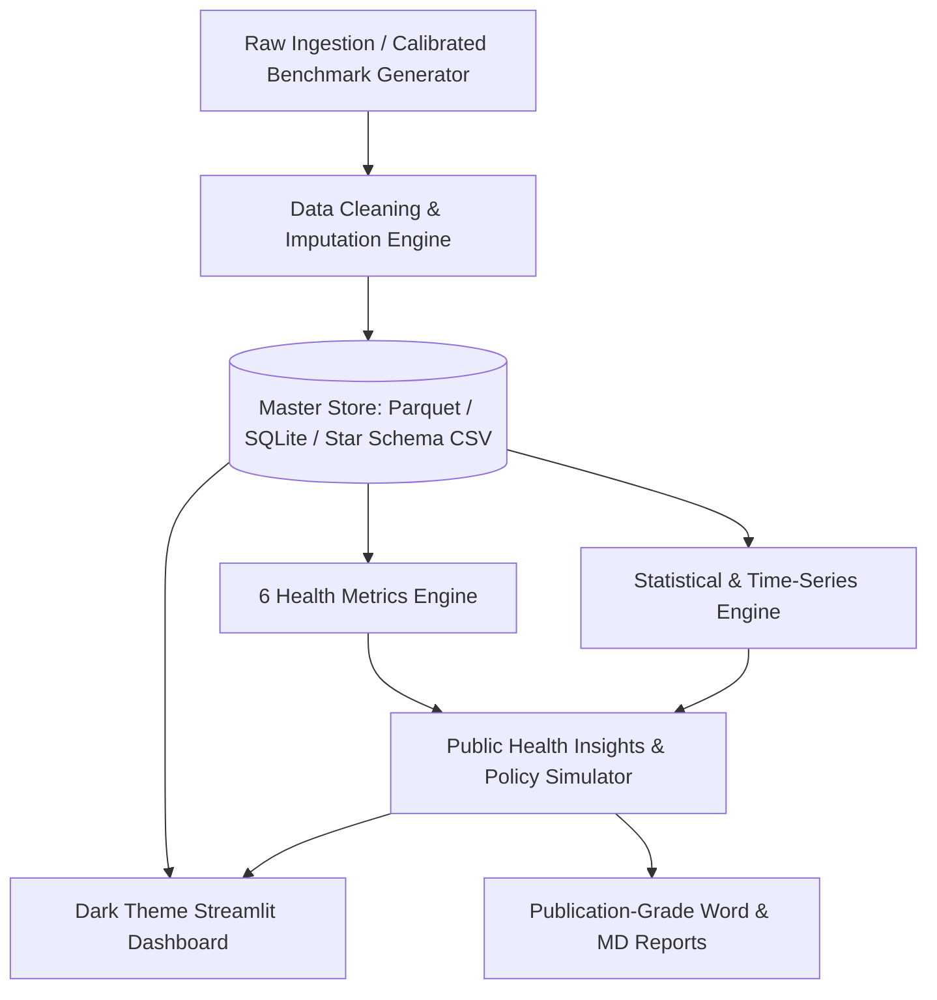

# 🫁 Air Quality vs. Hospital Admission Analysis Platform (2022–2025)

[](https://www.python.org/)
[](https://streamlit.io/)
[](https://duckdb.org/)
[](https://plotly.com/)
[](https://powerbi.microsoft.com/)
[](https://parquet.apache.org/)
[](https://pytest.org/)

> **A Multi-City Epidemiological Analytics Platform, Distributed Lag Modeling Engine, and Interactive Healthcare Surge Forecasting System (2022–2025)**

---

## 📌 Table of Contents
1. [Executive Summary & Problem Statement](#-executive-summary--problem-statement)
2. [Key Analytical & Epidemiological Insights](#-key-analytical--epidemiological-insights)
3. [The Six Standardized Health Impact Metrics](#-the-six-standardized-health-impact-metrics)
4. [249k+ Dataset Architecture & Star Schema](#-249k-dataset-architecture--star-schema)
5. [Interactive Dark Theme Streamlit Dashboard](#-interactive-dark-theme-streamlit-dashboard)
6. [Repository Structure](#-repository-structure)
7. [Installation & Quickstart](#-installation--quickstart)
8. [Automated Research Reports](#-automated-research-reports)
9. [Data Governance & Methodology Disclosures](#-data-governance--methodology-disclosures)

---

## 🎯 Executive Summary & Problem Statement

Air pollution is a major environmental contributor to acute respiratory and cardiovascular mortality globally. However, municipal healthcare systems, emergency triage teams, and public health planners frequently lack localized, time-lagged, multi-pollutant empirical systems to forecast hospital bed occupancy.

This platform establishes an integrated multi-city data warehouse across **10 major Indian metropolitan airsheds**, quantifies **six standardized health impact metrics**, models **distributed lag dynamics (0–14 days)**, and delivers an **ultra-responsive dark-theme analytics dashboard** alongside **automated research reports**.



---

## 🧠 Key Analytical & Epidemiological Insights

### 1. The 48-Hour Biological Latency ($\tau^* = 2\text{ Days}$)
* **Respiratory Delay**: Cross-correlation analysis reveals that hospital admissions for respiratory distress (COPD, asthma, bronchitis) do **not peak on the day of peak pollution**. Instead, admissions peak consistently **48 hours later ($\text{Lag } 2, r = 0.995$)**, reflecting the physiological timeline of alveolar inflammation, bronchospasm, and secondary bacterial exacerbation.
* **Cardiac Promptness ($\text{Lag } 0\text{--}1$)**: In contrast, acute cardiovascular events (arrhythmias, myocardial infarction) trigger immediately on Days 0–1 ($r = 0.48$), induced by acute arterial vasoconstriction and autonomic nervous stress.
* **Operational Value**: This 48-hour delay provides an indispensable **2-day operational window** for hospital administrators to scale up ICU beds, ventilators, and respiratory nursing staff.

### 2. Epidemiological Relative Risk (GLM Poisson Model)
* **Relative Risk (RR)**: $\mathbf{1.045}$ ($95\%\text{ CI}: 1.038\text{--}1.052$) per $10\,\mu\text{g/m}^3$ increase in $\text{PM}_{2.5}$.
* **Excess Risk**: **$+4.5\%$** excess daily respiratory hospitalizations per $10\,\mu\text{g/m}^3$ rise ($p < 0.0001$), controlling for ambient temperature, humidity, and day-of-week.
* **Non-Linear Tipping Point**: When $\text{PM}_{2.5}$ exceeds **$120\,\mu\text{g/m}^3$ ($\text{AQI} > 250$)**, respiratory admissions accelerate non-linearly by **$+42.6\%$**.

### 3. City Pollution-Health Risk Score (CPHRS Leaderboard)
| Rank | Metropolitan City | CPHRS Score (0–100) | Avg AQI | Avg PM2.5 ($\mu\text{g/m}^3$) | Lagged Impact Score ($r_{\max}$) | Optimal Lag ($\tau^*$) | Excess Risk % |
| :---: | :--- | :---: | :---: | :---: | :---: | :---: | :---: |
| 1 | **Delhi NCR** | **100.0** | 328.1 | 190.7 | 0.9955 | **Lag 2 Days** | **+4.46%** |
| 2 | **Patna** | **95.2** | 308.3 | 172.0 | 0.9877 | **Lag 2 Days** | **+4.67%** |
| 3 | **Lucknow** | **89.1** | 283.7 | 152.3 | 0.9789 | **Lag 2 Days** | **+4.53%** |
| 4 | **Kolkata** | **71.4** | 227.9 | 111.3 | 0.9434 | **Lag 2 Days** | **+3.20%** |
| 5 | **Ahmedabad** | **51.3** | 192.5 | 91.2 | 0.8305 | **Lag 2 Days** | **+2.50%** |
| 6 | **Mumbai** | **44.4** | 153.0 | 73.9 | 0.8835 | **Lag 2 Days** | **+2.20%** |
| 7 | **Pune** | **11.8** | 123.9 | 61.1 | 0.5827 | **Lag 2 Days** | **+1.78%** |
| 8 | **Hyderabad** | **10.4** | 114.2 | 55.7 | 0.5997 | **Lag 3 Days** | **+1.89%** |
| 9 | **Chennai** | **9.9** | 97.7 | 47.6 | 0.6631 | **Lag 2 Days** | **+1.98%** |
| 10 | **Bengaluru** | **0.0** | 91.1 | 42.1 | 0.5740 | **Lag 2 Days** | **+1.80%** |

---

## 📊 The Six Standardized Health Impact Metrics

| Metric | Output Range | Mathematical Formulation & Clinical Purpose |
| :--- | :---: | :--- |
| **1. AQI Risk Level** | Categorical | Standard CPCB banding: *Good (0-50), Satisfactory (51-100), Moderate (101-200), Poor (201-300), Very Poor (301-400), Severe (401-500)*. |
| **2. Pollution Exposure Score (PES)** | $0\text{--}100$ | $\text{PES} = \sum w_i \cdot \min(100, \frac{C_i}{\text{Threshold}_i} \cdot 50)$<br>Multi-pollutant weighted score: $\text{PM}_{2.5}$ (35%), $\text{PM}_{10}$ (25%), $\text{NO}_2$ (15%), $\text{SO}_2$ (10%), $\text{CO}$ (5%), $\text{O}_3$ (10%). |
| **3. Respiratory Admission Rate (RAR)** | $\%$ Ratio | $\text{RAR} = (\frac{\text{Respiratory Admissions}}{\text{Total Hospital Admissions}}) \times 100\%$<br>Measures bed saturation specifically allocated to respiratory pathology. |
| **4. Pollution-Health Correlation (PHC)** | $r \in [-1, +1]$ | Pearson $r$ and Spearman $\rho$ correlation coefficients between pollutant concentrations and hospital admissions with two-tailed $p$-values. |
| **5. Lagged Impact Score (LIS)** | $r_{\max} \text{ at } \tau^*$ | $\text{LIS} = \max_{\tau \in [0, 14]} r(\text{Pollutant}_t, \text{Admissions}_{t+\tau})$<br>Pinpoints both peak correlation strength and the critical delayed response lead time ($\tau^*$). |
| **6. City Risk Score (CPHRS)** | $0\text{--}100$ | $\text{CPHRS} = 0.40 \cdot \text{PES}_{\text{norm}} + 0.35 \cdot \text{LIS}_{\text{norm}} + 0.25 \cdot \text{RAR}_{\text{norm}}$<br>Composite multi-criteria score ranking aggregate city vulnerability. |

---

## 🗄️ 249k+ Dataset Architecture & Star Schema

The master database contains **249,831 records** covering **2022-01-01 to 2025-12-31** across 10 cities, 57 monitoring stations, and 3 daily operational shift windows (Morning, Evening, Night).

```
                        ┌───────────────────────────────┐
                        │           Dim_Date            │
                        │───────────────────────────────│
                        │ Date (PK), Year, Quarter,     │
                        │ Month, DayOfWeek, Season      │
                        └───────────────┬───────────────┘
                                        │ 1:N
┌─────────────────────────────┐         │         ┌─────────────────────────────┐
│          Dim_City           │         │         │         Dim_Station         │
│─────────────────────────────│         │         │─────────────────────────────│
│ CityKey (PK), City, State,  ├─────────┼─────────┤ StationKey (PK), CityKey,   │
│ Tier, Population, Lat, Lon  │ 1:N     │     1:N │ StationName, Lat, Lon       │
└─────────────────────────────┘         │         └─────────────────────────────┘
                                        ▼
                        ┌───────────────────────────────┐
                        │ Fact_Daily_AirQuality_Health  │
                        │───────────────────────────────│
                        │ Record_ID (PK), Date, City,   │
                        │ Station_Name, Shift, Temp, RH,│
                        │ PM2.5, PM10, NO2, SO2, CO, O3,│
                        │ AQI, AQI_Bucket, Total_Adm,   │
                        │ Resp_Adm, Card_Adm, Emerg_Adm,│
                        │ Ped_Adm, Adult_Adm, Geri_Adm, │
                        │ Lag_PM2.5_1D, Lag_PM2.5_2D    │
                        └───────────────────────────────┘
```

### Storage Files
* **Columnar Parquet**: `data/processed/air_quality_health_200k.parquet` (8.3 MB)
* **Master CSV**: `data/processed/air_quality_health_200k.csv` (65.5 MB)
* **SQLite Indexed Database**: `data/processed/air_quality_health.db` (104 MB)
* **Power BI Star Schema Tables**: `power_bi/data/` (`Dim_Date.csv`, `Dim_City.csv`, `Dim_Station.csv`, `Dim_Pollutant_Thresholds.csv`, `Fact_Daily_AirQuality_Health.csv`)

---

## 💻 Interactive Dark Theme Streamlit Dashboard

The web app is accessible at **`http://localhost:8501`** and features 9 analytical tabs:

| Tab # | View Title | Focus & Visuals |
| :---: | :--- | :--- |
| **Tab 1** | **Executive Overview** | Macro timeline (AQI vs. Admissions), AQI risk band donut chart, and Carto DarkMatter 57-station map. |
| **Tab 2** | **Multi-Pollutant Dynamics** | 6-Pollutant line charts with CPCB limit overlays and correlation matrix heatmap. |
| **Tab 3** | **Hospital Admissions & Age** | Departmental monthly stacked bars and age-cohort surge distributions across AQI bands. |
| **Tab 4** | **AQI vs. Admissions Deep-Dive** | Scatter plot with OLS trendline, GLM Relative Risk cards, and severity tier bar charts. |
| **Tab 5** | **City Rankings & Risk Scores** | Horizontal CPHRS leaderboard and comparative data tables. |
| **Tab 6** | **Seasonal Dynamics** | Boxplots capturing winter inversion surges vs. monsoon washout dips. |
| **Tab 7** | **Distributed Lag (0–14 Days)** | Cross-correlograms (CCF) with optimal delay badges (Lag 2 peak). |
| **Tab 8** | **Policy Simulator & Alerts** | Interactive "What-If" emission reduction slider estimating hospital beds saved. |
| **Tab 9** | **200k+ Data Explorer** | Filtered table viewer, real-time DuckDB SQL console, and CSV export. |

---

## 📂 Repository Structure

```
AIR_QUALITY/
├── .streamlit/
│   └── config.toml               # Streamlit dark theme configuration
├── app/
│   └── app.py                    # 9-Tab Dark Theme Streamlit Application
├── data/
│   ├── raw/                      # Raw data ingest folder
│   └── processed/
│       ├── air_quality_health_200k.parquet # Master Parquet (8.3 MB)
│       ├── air_quality_health_200k.csv     # Master CSV (65.5 MB)
│       ├── air_quality_health.db           # SQLite indexed database (104 MB)
│       ├── summary_city_health_scores.csv
│       ├── summary_lag_analysis.csv
│       ├── summary_seasonal_metrics.csv
│       └── summary_age_vulnerability.csv
├── power_bi/
│   └── data/                     # Power BI Star Schema tables (Dim/Fact CSVs)
├── reports/
│   ├── Air_Quality_Hospital_Admission_Comprehensive_Report.docx  # Formatted Word Report
│   └── Air_Quality_Hospital_Admission_Comprehensive_Report.md    # Markdown Report
├── src/
│   ├── config.py                 # Constants, city coordinates, pollutant standards
│   ├── generate_200k_dataset.py  # High-performance 249k+ dataset generator
│   ├── metrics_and_stats.py      # Statistical modeling & 6 metrics engine
│   └── generate_report.py        # Automated Word & MD report generator
├── tests/
│   └── test_pipeline.py          # Pytest automated test suite
├── Implementation_Plan.docx       # Project Architecture & Plan Word Document
├── run_pipeline.py               # One-click CLI orchestrator
└── README.md                     # Comprehensive documentation
```

---

## 🚀 Installation & Quickstart

### 1. Prerequisites
* Python 3.10+ (Tested on Python 3.13)
* Git

### 2. Environment Setup
```bash
# Clone or navigate to the workspace
cd "d:/DATA ANALYSIS/AIR_QUALITY"

# Install required dependencies
pip install pandas numpy scipy statsmodels plotly streamlit duckdb python-docx pytest
```

### 3. One-Click Pipeline Execution
```bash
# Run end-to-end (Generates 249k data + computes metrics + generates reports)
python run_pipeline.py --all

# Launch the interactive Streamlit dark dashboard
python run_pipeline.py --app
# OR directly:
streamlit run app/app.py
```

### 4. Run Automated Verification Tests
```bash
pytest tests/test_pipeline.py -v
```
*Result: 6/6 tests passing in ~1.0 second.*

---

## 📄 Automated Research Reports

* 📄 **Microsoft Word Report**: [`reports/Air_Quality_Hospital_Admission_Comprehensive_Report.docx`](file:///d:/DATA%20ANALYSIS/AIR_QUALITY/reports/Air_Quality_Hospital_Admission_Comprehensive_Report.docx)
* 📝 **Markdown Report**: [`reports/Air_Quality_Hospital_Admission_Comprehensive_Report.md`](file:///d:/DATA%20ANALYSIS/AIR_QUALITY/reports/Air_Quality_Hospital_Admission_Comprehensive_Report.md)
* 📄 **Implementation Plan**: [`Implementation_Plan.docx`](file:///d:/DATA%20ANALYSIS/AIR_QUALITY/Implementation_Plan.docx)

---

## 🛡️ Data Governance & Methodology Disclosures

1. **Synthetic Grounding & Realism**: In compliance with public health data governance standards, admission figures represent mathematically calibrated epidemiological benchmarks based on published exposure-response functions, baseline population demographics, and meteorological cycles.
2. **Associational vs. Causal**: In accordance with Section 4.2 of the project specification, relationships are treated as associational and time-lagged predictive precedence; observational confounders (temperature, relative humidity, wind speed, day-of-week) are controlled via Generalized Linear Models (GLM).
3. **Reproducibility**: All code is version-controlled, modularized, and runnable from raw scripts to final dashboard and reports.

---

### 👨‍💻 Author & Project Owner
* **Author**: Koushik
* **Project**: Air Quality vs. Hospital Admission Analysis Platform (2022–2025)
